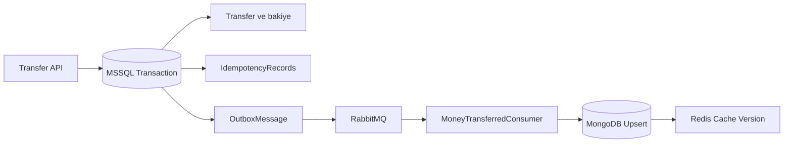
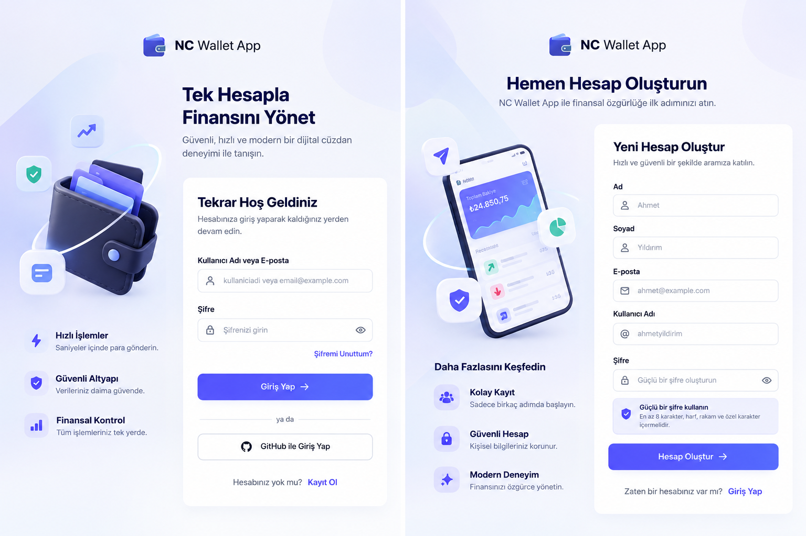

# 💰 NetCore Wallet Application

> **Modern Enterprise Architecture in Action** | Clean Architecture + DDD + CQRS + Event-Driven Architecture

[](https://dotnet.microsoft.com/)
[](https://github.com/ardalis/CleanArchitecture)
[](https://www.docker.com/)
[](https://www.rabbitmq.com/)
[](https://www.microsoft.com/sql-server)
[](https://www.mongodb.com/)
[](https://redis.io/)
[](https://xunit.net/)

---

## 📖 İçindekiler

- [Proje Tanımı](#-proje-tanımı)
- [Mimari Özellikleri](#-mimari-özellikleri)
- [Outbox ve Idempotency](#-transactional-outbox-ve-idempotency)
- [Teknik Stack](#-teknik-stack)
- [Proje Yapısı](#-proje-yapısı)
- [Frontend Uygulaması](#-frontend-uygulaması)
- [Best Practices](#-best-practices-özeti)
- [Kurulum](#-kurulum--çalıştırma)

---

## 🎯 Proje Tanımı

**NetCore Wallet Application**, kurumsal ölçekte bir para cüzdanı simülasyonudur. **Best practice** ve **en son mimarisi kalıplarının** gerçek senaryolarda implementasyonunu göstermeye çalıştım.

### Proje Hedefleri
✅ **Clean Architecture** ilkelerine tam uygun katman yapısı  
✅ **Domain-Driven Design (DDD)** - zengin domain modeli  
✅ **CQRS** - okuma/yazma ayrımı  
✅ **Event-Driven** - asenkron iş akışları  
✅ **Transactional Outbox** - MSSQL commit ve event kaydının atomikliği
✅ **Idempotency** - tekrarlanan API istekleri ve event teslimatlarına karşı koruma
✅ **Polyglot Persistence** - MSSQL + MongoDB + Redis  
✅ **Unit Tests** - XUnit + Moq  
✅ **Docker** - multi-container orchestration

---

## 🏗️ Mimari Özellikleri

### 💎 1. Domain-Driven Design (DDD) & Rich Domain Model

Veri tabanı odaklı *anemic domain* yaklaşımından uzak, **tüm iş kuralları doğrudan entity'lerde** tanımlı:

```csharp
public class Wallet : BaseEntity
{
	public string Code { get; private init; }
	public decimal Balance { get; private set; }

	public void Deposit(decimal amount)
	{
		if (amount <= 0) 
			throw new DomainException("Tutar pozitif olmalı");
		Balance += amount;
	}
}
```

**Avantajlar:**
- ✅ Type-safe business logic
- ✅ Data integrity guaranteed
- ✅ Reusable domain rules
- ✅ No duplicate validation

---

### 🔄 2. CQRS Pattern (Read/Write Segregation)

Command ve query sorumlulukları MediatR handler'larıyla ayrılır. MSSQL ana veri kaynağıdır; transaction history sorgusunda MongoDB read model ve Redis cache kullanılır:

```
WRITE: MSSQL (ACID, source of truth)
READ:
  - Wallet/User: MSSQL
  - Transaction History Hot Path: Redis
  - Transaction History Read Model: MongoDB
```

**Avantajlar:**
- ✅ Independent scalability
- ✅ Each DB optimized for purpose
- ✅ Write consistency + Read performance
- ✅ Elastic read layer

---

### ⚡ 3. End-to-End Async Architecture

**Tüm I/O asenkron** - Controller → Handler → Repository → Database

```csharp
public async Task<IActionResult> Register(RegisterCreateCommand command, CancellationToken ct)
{
	var result = await _mediator.Send(command, ct);
	return CreateActionResult(result);
}
```

**Avantajlar:**
- ✅ High throughput
- ✅ Thread pool efficiency
- ✅ Concurrent requests
- ✅ Cancellation support

---

### 🎯 4. Event-Driven Architecture

**MassTransit + RabbitMQ** ile asenkron messaging ve SQL tabanlı transactional outbox:

```
User Registered → Event Published → Consumer Processes → Wallet Created

Money Transfer → MSSQL Commit + Outbox → RabbitMQ → MongoDB Upsert → Redis Invalidation
```

**Avantajlar:**
- ✅ Loose coupling
- ✅ Asynchronous processing
- ✅ Built-in retry logic
- ✅ Error queue ile başarısız mesajların korunması
- ✅ RabbitMQ kesintisinde event kaybını önleyen outbox
- ✅ Audit trail

---

### 📬 5. Transactional Outbox ve Idempotency

Transfer sırasında bakiye, transaction, idempotency sonucu ve event aynı MSSQL transaction'ında saklanır. RabbitMQ erişilemiyorsa event `OutboxMessage` tablosunda bekler ve MassTransit broker geri geldiğinde teslimatı sürdürür.



İki ayrı idempotency katmanı bulunur:

- **API idempotency:** `(UserId, Idempotency-Key)` unique index'i ve SQL application lock ile aynı transferin iki kez uygulanmasını önler.
- **Consumer idempotency:** MongoDB'deki unique `TransactionId` index'i ve atomic upsert ile tekrar teslim edilen event'in çift audit kaydı üretmesini önler.

Detaylı teknik açıklama: [Outbox Pattern ve Idempotency](OUTBOX-IDEMPOTENCY.md)

---

### 🛡️ 6. Result Pattern & Type-Safe Errors

```csharp
public async Task<Result<TransactionDto>> TransferAsync(...)
{
	if (insufficient) 
		return Result<TransactionDto>.Failure("Yetersiz bakiye", ResultStatus.BadRequest);

	return Result<TransactionDto>.Success(tx, ResultStatus.Ok);
}

// JSON Response
{
  "isSuccess": true,
  "status": 200,
  "data": { "id": "...", "amount": 100 },
  "error": null
}
```

---

## 🛠️ Teknik Stack

### Core (Domain & Application)
- **C# 14** - Primary constructors, records
- **MediatR** - CQRS + handlers
- **FluentValidation** - Declarative rules
- **AutoMapper** - DTO mapping
- **MassTransit** - Event bus + EF Core transactional outbox/inbox

### Infrastructure
- **EF Core 10** - ORM + migrations
- **Dapper** - Complex queries
- **MSSQL 2022** - Relational DB (Write)
- **MongoDB** - Document DB (Read)
- **Redis** - Cache layer
- **RabbitMQ** - Message broker
- **SQL Application Lock** - Concurrent idempotency-key serialization

### Presentation
- **ASP.NET Core 10** - REST API
- **JWT Bearer** - Authentication
- **Scalar UI** - API documentation
- **Serilog** - Structured logging

### Testing & DevOps
- **xUnit** - Tests
- **Moq** - Mocking
- **Docker** - Containers
- **Docker Compose** - Orchestration

---

## 📁 Proje Yapısı

```
Wallet/
├── Core/
│   ├── Domain/
│   │   ├── Entities/          ← Rich domain models
│   │   ├── Exceptions/        ← Business exceptions
│   │   └── Common/
│   │
│   └── Application/
│       ├── Common/            ← Result pattern, Behaviors
│       ├── Contracts/         ← Interfaces (IRepository, etc)
│       └── Features/          ← CQRS Commands/Queries/Handlers
│
├── Infrastructure/
│   └── Persistence/
│       ├── Context/           ← EF Core DbContext
│       ├── Configurations/    ← Entity, outbox ve idempotency mappings
│       ├── Migrations/        ← SQL schema migrations
│       ├── Repository/        ← Repository pattern impl
│       ├── Consumers/         ← Event handlers
│       └── Services/          ← Business services
│
├── Presentation/
│   ├── WebApi/
│       ├── Controllers/       ← REST endpoints
│       ├── Middlewares/       ← Exception handling
│       ├── Program.cs         ← Auto-migration setup
│       └── appsettings.json
│   └── Frontend/              ← React + Vite + TypeScript arayüzü
│       ├── src/features/      ← Auth, wallet, transfer, contacts, architecture
│       ├── e2e/               ← Playwright uçtan uca senaryoları
│       ├── Dockerfile         ← Nginx ile production frontend
│       └── README.md          ← Frontend'e özel notlar
│
├── Tests/                      ← Unit tests
├── OUTBOX-IDEMPOTENCY.md       ← Obsidian uyumlu teknik doküman
└── docker-compose.yml
```

---

## ✨ Best Practices Özeti

### SOLID Principles
- ✅ **S** - Single Responsibility → Her class bir nedenden değişir
- ✅ **O** - Open/Closed → Extension açık, modification kapalı
- ✅ **L** - Liskov Substitution → Inheritance güvenli
- ✅ **I** - Interface Segregation → Focused interfaces
- ✅ **D** - Dependency Inversion → Abstraction'lara bağımlı

### Design Patterns
- ✅ **Repository** - Data access abstraction
- ✅ **Unit of Work** - Atomic transactions
- ✅ **Decorator** - Pipeline behaviors
- ✅ **Observer** - Event-driven
- ✅ **Strategy** - Multiple implementations (Dapper vs EF)
- ✅ **Transactional Outbox/Inbox** - Database commit ve mesaj teslimatı güvenliği
- ✅ **Idempotent Consumer** - At-least-once teslimatta effectively-once iş sonucu
- ✅ **Cache Versioning** - Redis'te `KEYS` taraması olmadan invalidation

### Code Quality
- ✅ **No magic strings** → Constants/Enums
- ✅ **No null checks hell** → Guard clauses
- ✅ **No circular deps** → DI
- ✅ **No fat controllers** → MediatR handlers
- ✅ **No data leaks** → Result pattern
- ✅ **Type-safe** → Record types, primary constructors
- ✅ **Async-first** → Cancellation tokens
- ✅ **Testable** → Dependency injection

---

## 🖥️ Frontend Uygulaması

Frontend; React, Vite ve TypeScript kullanır. Giriş/kayıt, cüzdan özeti, para yatırma/çekme, transfer, işlem geçmişi ve transfer kişileri ekranlarına ek olarak `/architecture` adresinde event-driven veri akışını öğretici bir sayfada gösterir.

Login ve kayıt ekranları için tasarım referansı:



Mimari ekran MSSQL → Outbox → RabbitMQ → MongoDB → Redis sırasını anlatır. RabbitMQ kesintisi düğmeleri **eğitim simülasyonudur**; gerçek servis sağlığını izlemez ve gerçek transfer yapmaz. Servis kartlarında canlı sağlık ölçümü olmadığı belirtilir.

### Arayüzü Docker ile çalıştırma

Repo kökünde:

```powershell
docker compose up -d --build
```

Arayüz `http://localhost:5173`, API `http://localhost:5001`, API belgeleri `http://localhost:5001/scalar/` adresindedir. Vite geliştirme sunucusu da 5173 portunu kullandığından Docker arayüzünü açmadan önce `npm run dev` çalışan terminali `Ctrl+C` ile durdurun.

### Frontend geliştirme sunucusu

Önce backend servislerini repo kökünden başlatın:

```powershell
docker compose up -d sqlserver mongodb redis rabbitmq wallet-api
```

Yeni bir terminalde frontend:

```powershell
cd Presentation/Frontend
npm ci
npm run dev -- --host 127.0.0.1
```

Vite `http://localhost:5173` adresinde açılır. İlk kullanımda kayıt ekranından (`/register`) hesap oluşturup giriş yapın. Oturum aynı sekme açık kaldığı sürece korunur.

### Playwright testleri

Testler `Presentation/Frontend/e2e/` içindedir. `playwright.config.ts`, test öncesinde Vite sunucusunu açar ve masaüstü Chrome projesini çalıştırır. Test API yanıtlarını tarayıcıda taklit eder; gerçek SQL/MongoDB verisine veya bakiyeye dokunmaz.

```powershell
cd Presentation/Frontend
npm ci
npm run test:e2e
```

Komut seçenekleri:

```powershell
# Testi görünür Chrome penceresinde izle
npx playwright test --headed

# Etkileşimli Playwright panelini aç; testleri seçip adım adım çalıştır
npm run test:e2e:ui

# Belirli bir senaryoyu çalıştır
npx playwright test e2e/login-to-transfer.spec.ts
```

Bu projedeki Playwright ayarı Windows'ta kurulu **Google Chrome** kanalını (`channel: 'chrome'`) kullanır. Bu nedenle `--headed` ve diğer Playwright komutları için Google Chrome kurulu olmalıdır. Test raporu konsolda listelenir; hata ekran görüntüsü ve trace `Presentation/Frontend/test-results/` altında tutulur. Bir trace'i incelemek için:

```powershell
$trace = Get-ChildItem test-results -Recurse -Filter trace.zip | Select-Object -First 1 -ExpandProperty FullName
npx playwright show-trace $trace
```

Trace Viewer zaman çizelgesinde tıklamaları, ağ isteklerini, DOM görüntüsünü ve hatanın oluştuğu adımı gösterir.

Unit/component kontrolleri ve production build:

```powershell
npm run lint
npm run typecheck
npm test
npm run build
```

Detaylı arayüz notları [Frontend README](Presentation/Frontend/README.md), faz listesi ise [Obsidian Frontend Fazları](Obsidian/05-Frontend-Fazlari.md) içindedir.

---

## 📦 Kurulum & Çalıştırma

### Quick Start (Docker)

```bash
# Klonla
git clone https://github.com/enesxcodev/NetCoreWalletApp.git
cd Wallet

# Başlat
docker compose up -d --build

# Logları izle
docker compose logs -f wallet-api

# API'ya eriş
http://localhost:5001/scalar/
```

### Services & Ports

| Servis | Port | URL |
|--------|------|-----|
| **API** | 5001 | http://localhost:5001 |
| **API Docs** | 5001 | http://localhost:5001/scalar/ |
| **Frontend** | 5173 | http://localhost:5173 |
| **SQL Server** | 1433 | localhost:1433 |
| **RabbitMQ** | 15672 | http://localhost:15672 |
| **MongoDB** | 27017 | localhost:27017 |
| **Redis** | 6379 | localhost:6379 |

### Local Development

```bash
# Migrationları oluştur
dotnet ef migrations add [Name] \
  --project Infrastructure/Persistence/Persistence.csproj \
  --startup-project Presentation/WebApi/WebApi.csproj

# Testleri çalıştır
dotnet test Wallet.slnx

# F5 ile başlat (appsettings.Development.json configure et)
```

---

## 🔌 API Endpoints

### Register
```http
POST /api/auth/register
Content-Type: application/json

{
  "firstName": "Ahmet",
  "lastName": "Yıldırım",
  "email": "ahmet@example.com",
  "userName": "ahmetyildirim",
  "password": "SecurePass123!"
}

Response: 201 Created
{ "isSuccess": true, "status": 201, "data": "user-id" }
```

### Login
```http
POST /api/auth/login
{ "userName": "ahmetyildirim", "password": "SecurePass123!" }

Response: 200 OK
{ "isSuccess": true, "status": 200, "data": "jwt...", "isFailure": false }
```

### Wallet Deposit
```http
POST /api/wallet/deposit
Authorization: Bearer {token}
{ "amount": 100 }

Response: 204 No Content
```

### Money Transfer

Her mantıksal transfer için yeni bir UUID üretin. Ağ hatasında aynı isteği yeniden gönderirken **aynı** `Idempotency-Key` değerini kullanın.

```http
POST /api/wallet/transfer
Authorization: Bearer {token}
Idempotency-Key: 8bff04aa-f746-4efe-a0cf-65b08ed76fa7
Content-Type: application/json

{
  "walletCode": "WLT-RECEIVER",
  "amount": 100,
  "description": "borç ödemesi"
}

Response: 200 OK
{
  "data": "transaction-guid",
  "isSuccess": true,
  "status": 200,
  "isFailure": false
}
```

Davranış:

- Header eksik veya UUID değilse `400 Bad Request`
- Aynı key ve aynı payload tekrar gönderilirse aynı `TransactionId`
- Aynı key farklı payload ile gönderilirse `409 Conflict`

---

## 📊 Proje Güçlü Yanları

1. ✅ **Solid Architecture** - Perfect layering
2. ✅ **Rich Domain Model** - Type-safe business logic
3. ✅ **CQRS** - Read/write separation
4. ✅ **Event-Driven** - Loose coupling
5. ✅ **Async-First** - High throughput
6. ✅ **Result Pattern** - Type-safe errors
7. ✅ **Polyglot Persistence** - Optimized for each use case
8. ✅ **Repository Pattern** - Testable, abstract
9. ✅ **Unit of Work** - Transaction safety
10. ✅ **Comprehensive Tests** - XUnit + Moq
11. ✅ **Docker Ready** - Production-ready
12. ✅ **Modern C#** - Cutting-edge features
13. ✅ **JWT Security** - Token-based auth
14. ✅ **Structured Logging** - Observable
15. ✅ **Global Exception Handler** - Centralized error handling
16. ✅ **Transactional Outbox** - Broker kesintisinde event kaybını önleme
17. ✅ **End-to-End Idempotency** - API ve consumer duplicate koruması

---

## 🚀 Öğrenme Kaynakları

- [Clean Architecture](https://blog.cleancoder.com/uncle-bob/2012/08/13/the-clean-architecture.html)
- [Domain-Driven Design](https://www.domainlanguage.com/ddd/)
- [CQRS Pattern](https://docs.microsoft.com/en-us/azure/architecture/patterns/cqrs)
- [MediatR Documentation](https://github.com/jbogard/MediatR)
- [Result Pattern](https://www.youtube.com/watch?v=bUQY-RO1gvs)

---

**⭐ Eğer yararlı oldu, bir star vermeyi unutmayın!**

Temiz kodlamalar! 🚀
